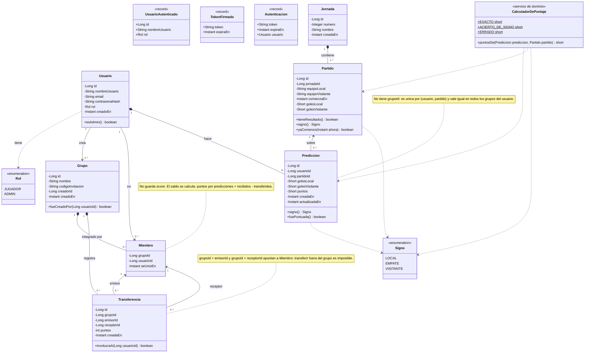
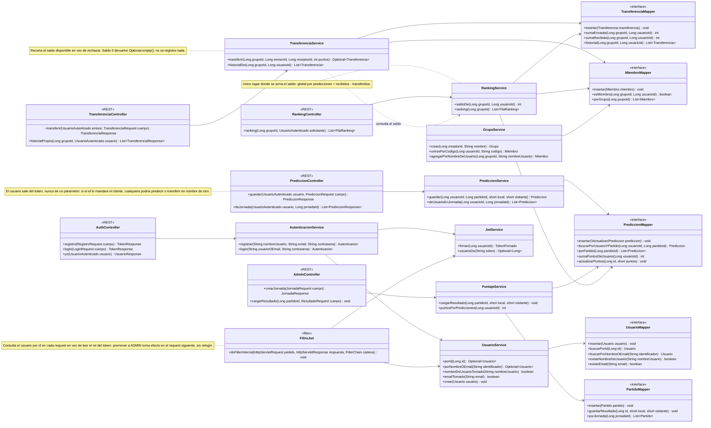
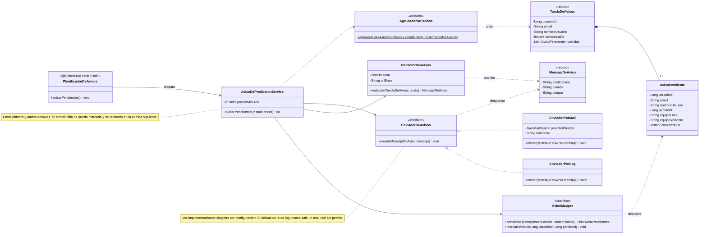

# TruchoProde — Diagrama de clases

Modelo de clases del backend, derivado de la especificación funcional
(`TruchoProde_Especificacion.md`) y del esquema `V1__esquema_inicial.sql`.

Convenciones de las relaciones:

| Notación | Significado | En la base |
|---|---|---|
| `*--` composición | la parte no existe sin el todo | FK con `ON DELETE CASCADE` |
| `-->` asociación | referencia, con vida propia | FK sin cascada |
| `..>` dependencia | la usa, no la contiene | — |
| `<\|--` herencia | generalización | — |
| `<\|..` realización | implementa una interfaz | — |

---

## 1. Dominio

Las siete entidades confirmadas más los dos enums y el cálculo del puntaje.
Las entidades son puras: sin anotaciones de infraestructura, como pide la arquitectura.

**Por qué esas relaciones**

- `Grupo *-- Miembro` es composición: borrado el grupo, la membresía no significa nada.
  `Usuario --> Miembro` es asociación: el usuario sobrevive a cualquier grupo.
- `Usuario *-- Prediccion` es composición y `Prediccion --> Partido` asociación: la predicción
  es del jugador; el partido es un dato global que existe aunque nadie prediga.
- `Transferencia` apunta dos veces a `Miembro`, no a `Usuario`. Ese es el punto: la relación
  con el grupo es lo que hace verificable la regla de "solo dentro del mismo grupo".
- `Miembro` no tiene `score`. El saldo es derivado, así que es una operación de servicio,
  no un atributo.

---

## 2. Capas de aplicación

Flujo `Controller → Service → Mapper`, con MyBatis en el borde.

---

## 3. Avisos por mail

El recordatorio de predicciones pendientes. Es la primera vertical implementada de punta a punta,
y la única parte del sistema que arranca sola: no la dispara una petición HTTP sino el reloj.

**Por qué está partido así**

- `PlanificadorDeAvisos` solo mira el reloj y llama al service. Toda la lógica quedó afuera del
  `@Scheduled`, que es lo que permite probarla sin esperar cinco minutos.
- `AgrupadorDeTandas` y `RedactorDeAvisos` son funciones puras: sin base, sin mail, sin Spring. Son
  los dos únicos lugares donde vive la regla de "una tanda es un mail" y el texto que lee la persona.
- `EnviadorDeAvisos` existe para que el service **no sepa** si el mail sale por SMTP o a la consola.
  El default es el de log, así que mandar un mail real es una decisión explícita de configuración.
- `AvisoPendiente` no es una tabla: es la fila del cruce entre partidos y usuarios que devuelve la
  consulta.

---

## 4. Excepciones de dominio

La única herencia real del modelo. El resto del dominio es plano a propósito:
no hay dos entidades que compartan comportamiento como para justificar una superclase.

```mermaid
classDiagram
    direction TB

    class RuntimeException {
        <<java.lang>>
    }
    class TruchoProdeException {
        <<abstract>>
        #String mensaje
        +codigo() String*
        +estadoHttp() int*
    }
    class RecursoNoEncontradoException {
        +codigo() String
        +estadoHttp() int
    }
    class NoAutorizadoException {
        +estadoHttp() int
    }
    class NoEsMiembroDelGrupoException {
        -Long grupoId
        +codigo() String
    }
    class RequiereRolAdminException {
        +codigo() String
    }
    class ReglaDeNegocioException {
        +estadoHttp() int
    }
    class PartidoYaComenzoException {
        -Long partidoId
        +codigo() String
    }
    class ResultadoInvalidoException {
        +codigo() String
    }

    RuntimeException <|-- TruchoProdeException
    TruchoProdeException <|-- RecursoNoEncontradoException
    TruchoProdeException <|-- NoAutorizadoException
    TruchoProdeException <|-- ReglaDeNegocioException
    NoAutorizadoException <|-- NoEsMiembroDelGrupoException
    NoAutorizadoException <|-- RequiereRolAdminException
    ReglaDeNegocioException <|-- PartidoYaComenzoException
    ReglaDeNegocioException <|-- ResultadoInvalidoException

    class NoAutenticadoException {
        +estadoHttp() int
    }
    class CredencialesInvalidasException {
        +codigo() String
    }
    class NombreDeUsuarioTomadoException {
        +codigo() String
    }
    class EmailTomadoException {
        +codigo() String
    }

    TruchoProdeException <|-- NoAutenticadoException
    NoAutenticadoException <|-- CredencialesInvalidasException
    ReglaDeNegocioException <|-- NombreDeUsuarioTomadoException
    ReglaDeNegocioException <|-- EmailTomadoException

    note for NoEsMiembroDelGrupoException "El secreto de las transferencias es autorizacion, no UI: el backend corta aca."
    note for NoAutenticadoException "401 es 'no se quien sos'. NoAutorizadoException es 403: 'se quien sos y no te alcanza'. Confundirlas es el error clasico."
    note for CredencialesInvalidasException "Un solo error para el usuario inexistente y la contrasena mal: si fueran distintos, el login serviria para averiguar que cuentas existen."
```

---

## 5. Del diagrama al esquema

| En el diagrama | En `V1__esquema_inicial.sql` |
|---|---|
| `Prediccion` sin `grupoId` | `UNIQUE (usuario_id, partido_id)` |
| `Transferencia --> Miembro` (dos veces) | FKs compuestas a `miembro (grupo_id, usuario_id)` |
| `Transferencia.puntos : int` positivo | `CHECK (puntos > 0)` |
| `Miembro` sin `score` | `miembro` sin columna de saldo |
| `Grupo *-- Miembro` | `ON DELETE CASCADE` |
| `Miembro <-- Transferencia` | sin cascada: el historial es inmutable |
| `Usuario.rol : Rol` | `CHECK (rol IN ('JUGADOR','ADMIN'))` |
| `Partido.golesLocal : Short` | anulable, con `CHECK` de resultado completo |
| aviso enviado una sola vez | `aviso_prediccion` con PK `(usuario_id, partido_id)` (V2) |
| preferencia de avisos | `usuario.quiere_avisos BOOLEAN NOT NULL DEFAULT TRUE` (V2) |
| `FiltroJwt` lee el rol en cada request | consulta `usuario` por id; el token solo lleva el `sub` |
| `Usuario.contrasenaHash` con BCrypt | `contrasena_hash VARCHAR(100)`: BCrypt ocupa 60 |

---

## Pendientes

- Si el creador del grupo conserva atribuciones (expulsar, renombrar) o es solo un dato histórico.

Confirmado desde entonces: se puede predecir **hasta que empieza el partido**, y por eso
`Partido.yaComenzo(...)` se queda en el modelo.
